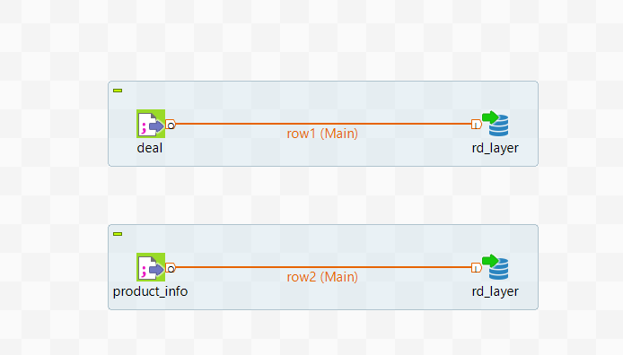

# Проектное задание 2

## Задача 2.1

Задание - устранить дубли в имеющейся БД. Файл: task2.1.sql

## Задание 2.2

Задание - заполнить схему rd недостающими данными из csv и исправить витрину dm.loan_holiday_info. Способ заполнения файлов - Talend, джоб лежит в папке Talend. Процедура, заполняющая витрину - файл task2.2.sql

Как сделан джоб:

## Задание 2.3

Необходимо скорректировать данные в таблице с остатками на начало и конец дня, а также написать процедуру, для перезагрузки данных в витрину. Файл - task2.3.sql
